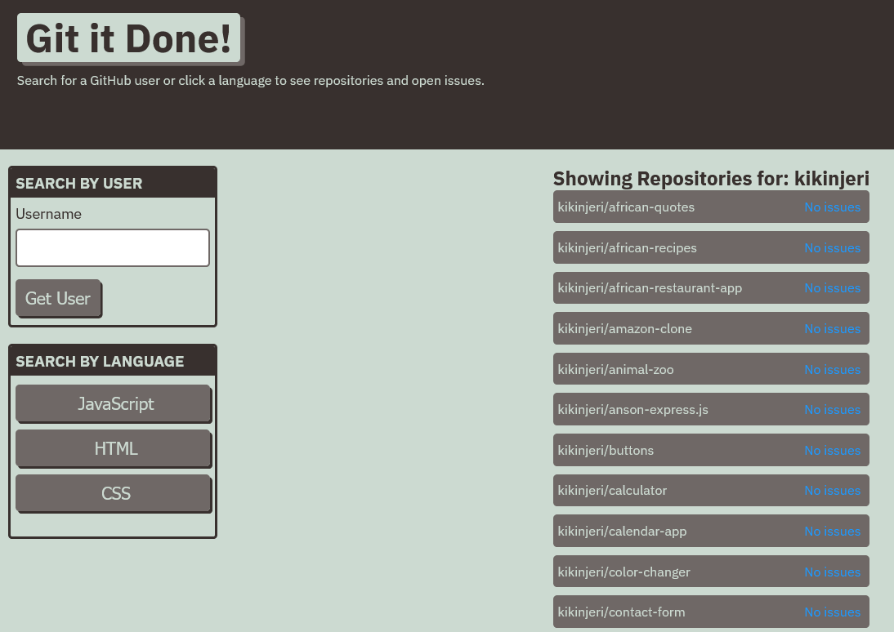

# 🛠️ Git-It-Done

A sleek and modern task management web app built to help developers and teams stay productive.  
Git-It-Done combines simplicity with power — allowing you to create, track, and complete tasks effortlessly.  

  


---

## 🚀 Features

- 📝 **Add, Edit, and Delete Tasks**  
- ✅ **Mark Tasks as Completed**  
- 💾 **Local Storage Integration** — your data stays even after refreshing  
- 🎨 **Responsive & Modern UI**  
- 🌙 **Light/Dark Mode Toggle**  
- ⚡ **Fast and Optimized for Performance**

---

## 🧠 Tech Stack

- **Frontend:** React.js + Vite  
- **Styling:** Tailwind CSS / CSS Modules  
- **Icons:** Heroicons  
- **Data Storage:** Local Storage (Browser-based)  
- **Version Control:** Git & GitHub  

---

## 🧩 Folder Structure

```
git-it-done/
├── src/
│   ├── components/
│   ├── assets/
│   ├── App.jsx
│   └── main.jsx
├── public/
├── package.json
├── vite.config.js
└── README.md
```

---

## ⚙️ Installation & Setup

1. Clone the repository  
   ```bash
   git clone https://github.com/<your-username>/git-it-done.git
   ```
2. Navigate to the project folder  
   ```bash
   cd git-it-done
   ```
3. Install dependencies  
   ```bash
   npm install
   ```
4. Run the development server  
   ```bash
   npm run dev
   ```
5. Open in your browser  
   ```
   http://localhost:5173
   ```

---

## 🌐 Deployment

Deploy easily on **GitHub Pages**, **Netlify**, or **Vercel**.

Example (GitHub Pages):
```bash
npm run build
npm run deploy
```

---

## 🧑‍💻 Author

**Mwihaki Githii**  
📧 [wikigi.git@gmail.com](mailto:wikigi.git@gmail.com)  
🌍 [Portfolio Website](https://github.com/kikinjeri)

---

## 📸 Screenshot Placeholder

Add your project screenshot to `/assets/screenshot-placeholder.png` and replace the image link above.

---

## 🪪 License

This project is licensed under the **MIT License** — free to use, modify, and distribute.

---

> Made with ❤️ by Mwihaki Githii — turning ideas into clean, functional web apps.
